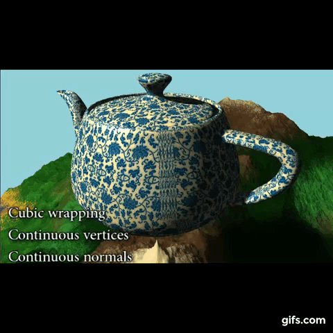
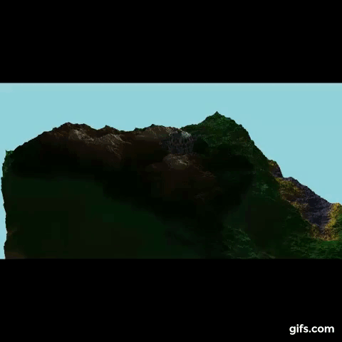
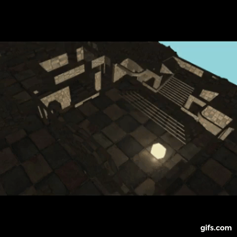

# scop, Summer 2015
>>>>> ##### .obj rendering with OpenGL 4.1

##### Grade ``(TBD/100)`` ``(TBD/125)*``
--------  -----------------------


##### Goals:
- [X] Code in `C`, observing 42's norm (see below)
- [X] Use modern OpenGL, >=4.0 with shaders
- [X] Parse and render a `.obj` file
- [X] Rotation around y axis
- [X] Apply grey shades on each faces
- [X] Apply a texture on the object
- [X] No math/3d library allowed

##### Recommended bonus:
- [X] Handle any .obj
- [X] Smart texture projection

##### My work:
- [X] Watched a course from `UC Davis` on youtube (see below)
- [X] Read `Learn OpenGL` website (see below)
- [X] Used `GLFW` for window handling
- [X] Matrix operations
- [X] Randomly generated land at startup. Built on GPU
- [X] Blinn–Phong single source lighting. Represented with a movable yellow sun
- [X] Shadows with depth cubemap
- [X] Tesselation on sun from a tetrahedron to a sphere. (Automatic or controls with keyboard)
- [X] Tesselation on land from {color,height,normal}maps generated at startup
- [X] Advanced mesh processing
- [X] Multiple texture projections
- [X] Dynamic controls for object/textures/texture-projection-mode/mesh-processing/camera-potion/object-position/sun-position/sun-tesselation
<BR>
<BR>

### Useful links:
###### Introduction to Graphics Architecture:
- https://www.youtube.com/playlist?list=PL4A8BA1C3B38CFCA0

###### Learn OpenGL:
- http://learnopengl.com/

###### Light shading, Flat vs Gouraud vs Phong
- https://cg2010studio.files.wordpress.com/2011/11/comparison-flat-gouraud-phong-shading.jpg

<BR>

---

### Videos:
> https://vine.co/u/1241053296954363904

##### Live mesh processing
<BR>

##### Live lighting and shadows on land
<BR>

##### Live lighting and shadows in room
<BR>


<BR><BR>

---

```
All my C files strictly observes school's norm, it may often lead to odd or illogical syntaxes.
- [ ] Forbiden keywords: for, do, switch, goto.
- [ ] No more than 25 lines inside a function block.
- [ ] No more than 80 characters per lines.
- [ ] At most 5 functions per files.
- [ ] Only 1 declaration per line.  
- [ ] No declaration and assignation on the same line.
- [ ] At most 1 assignation per line.
- [ ] No more than 4 parameters for a function.
- [ ] No nested ternary.
- [ ] Comments alowed at the top of the file.
```
```
*
- A grade of 85 was required to validate the project.
- A maximum grade of 125 was reachable.
- Second sessions are organised for failed projects.
```

---
